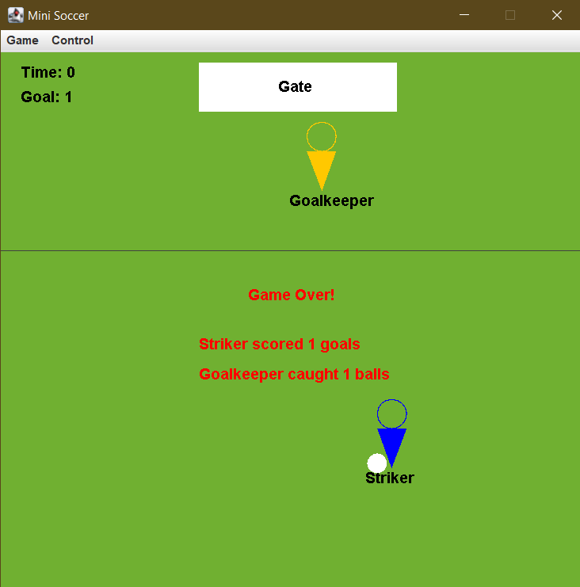

# Mini Soccer Game

A mini soccer game written in Java 11 using Java Swing.

Featuring design pattern/principle:

* Singleton
* Iterator
* Factory
* Sorting
* Collection
* Polymorphism
* Inheritance

## Control/Rules

### Movement

Use the `ArrorKeys` to control the movement of `Striker`.

`Goalkeeper` moves randomly in a gaussian distribution fashion, where the center of the gate
acts as the `mean value`.

`Striker` and `Goalkepper` cannot cross the penalty line.

### Ball control

Use the `Spacebar` to shoot bar with the `Stiker`.

`Goalkeeper` will pick up `SoccerBall` if the ball falls within its side of the penalty line and
not in the gate.

`GamePlayer` will pick up `SoccerBall` if they're within `55` radius of each other.

### Score/Catch ball

If the `SoccerBall` shot by `Striker` lands in the gate area, the `goal` of the current game will
increment by 1, game will set to `pause`, and the position of `SoccerBall`, `Stiker` and `Goalkeeper` will be reset.

If the `SoccerBall` shot by `Striker` lands in its side of the penalty line, nothing will happen.

If the `SoccerBall` shot by `Striker` lands in the other side of the penalty line, and not in the
gate area, `Goalkeeper` will catch the `SoccerBall` automatically and considered have **caught 1 ball**.
Then `Goalkeeper` will kick the `SoccerBall` back to the `Striker` side of the penalty line.

### Game states

Game is `over` if and only if the remaining time is `0`.

If the game is on `pause`, neither `GamePlayer` nor `SoccerBall` can move.

If the game is `over`, the statistics of each `GamePlayer` will be sorted and displayed, while all controls,
including `pause` and `resume` will be disabled until a new `SoccerGame` is started.

## Screenshots

| In game    | Game over   |
| :------------: | :----------: |
|  |  |
